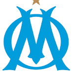
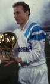
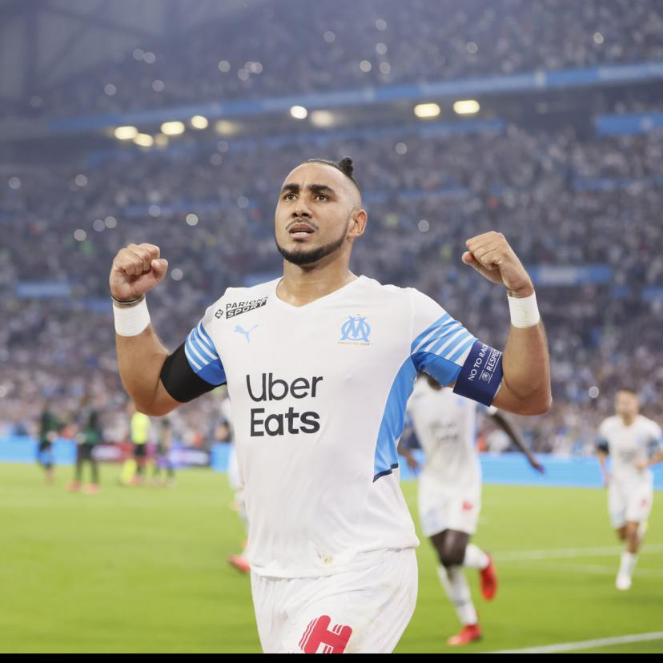
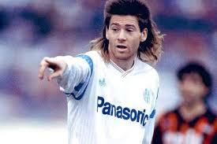
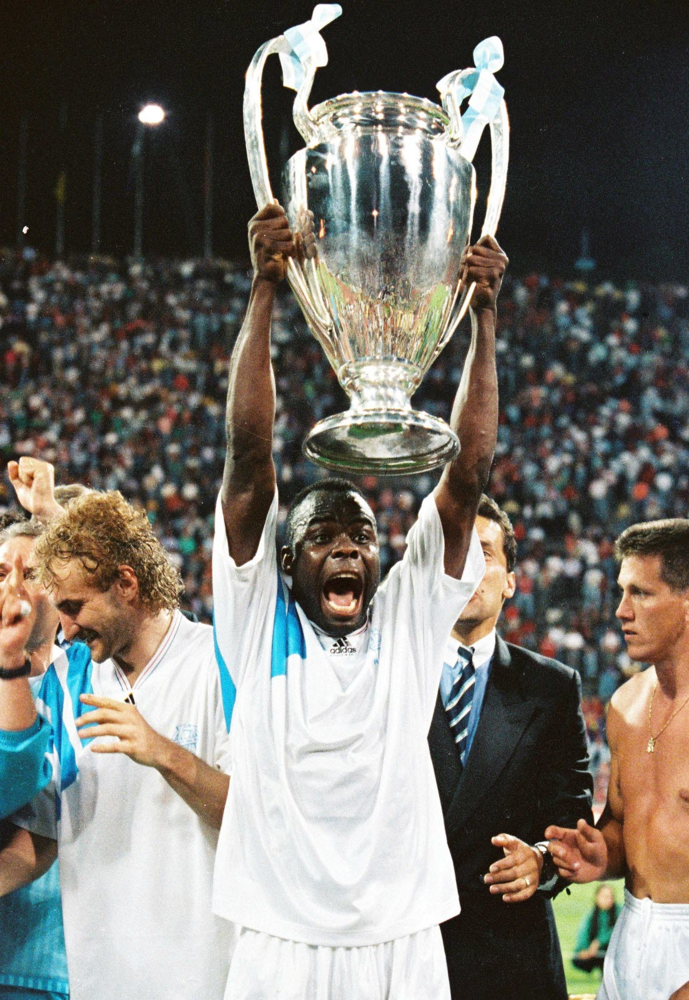

# 🔵⚪ L'OLYMPIQUE DE MARSEILLE
## Une légende du football français



---

## 📅 FRISE CHRONOLOGIQUE : LES GRANDES ÉPOQUES DE L'OM

### 🏛️ **1899-1930 : La Naissance d'une Légende**
- **31 août 1899** : Création officielle de l'Olympique de Marseille
- Fusion du Football Club de Marseille avec le club d'escrime "L'Épée"
- Devise du club : **"Droit au but"**
- **1924, 1926, 1927** : Premières Coupes de France (premier club de province à gagner ce trophée)

### ⚽ **1930-1970 : Les Premières Gloires**
- **1937** : Premier titre de Champion de France professionnel
- **1937** : Inauguration du mythique **Stade Vélodrome**
- **1938** : 5ème Coupe de France
- Période marquée par des joueurs comme Joseph Alcazar et Joseph Eisenhoffer

### 🌟 **1971-1976 : L'Ère Leclerc**
- **1971** : Champion de France (après 23 ans d'attente)
- **1972** : Le doublé historique Coupe-Championnat
- Josip Skoblar devient une légende avec 175 buts
- Roger Magnusson et Gunnar Andersson font briller l'OM

### 💫 **1986-1994 : L'ÈRE TAPIE - L'ÂGE D'OR**
Bernard Tapie rachète l'OM et transforme le club en géant européen :
- **1989, 1990, 1991, 1992** : 4 titres de Champion de France consécutifs
- **1989** : Coupe de France avec un triplé de Papin
- **1991** : Finale de C1 perdue à Bari (0-0, 5-3 t.a.b)
- **26 MAI 1993** : 🏆 **VICTOIRE EN LIGUE DES CHAMPIONS** à Munich face au Milan AC (1-0, but de Basile Boli)
  - Seul club français à avoir remporté la C1
  - L'OM au sommet de l'Europe !
- **1993-1994** : L'affaire VA-OM et la rétrogradation en D2

### 📉 **1994-2000 : La Traversée du Désert**
- Rétrogradation administrative en D2
- Difficultés financières
- Remontée en 1996
- Rachat par Robert Louis-Dreyfus

### 🏆 **2000-2012 : Le Renouveau**
- **1999 & 2004** : Deux finales de Coupe UEFA perdues
- **2010** : Champion de France sous Didier Deschamps
- **2010, 2011, 2012** : Triplé en Coupe de la Ligue
- **2010, 2011** : Trophée des Champions
- Joueurs emblématiques : Mamadou Niang, Samir Nasri, André-Pierre Gignac

### 🌍 **2016-Présent : L'Ère McCourt**
- **2016** : Rachat par Frank McCourt
- **2018** : Finale de Ligue Europa perdue face à l'Atlético Madrid (0-3)
- Dimitri Payet devient capitaine et idole
- Nouvelles ambitions européennes
- Le club continue d'écrire son histoire...

---

## 🌟 LES LÉGENDES DU CLUB

### **Jean-Pierre PAPIN** - "JPP, l'Olympien du Siècle"


**🏅 Période à l'OM** : 1986-1992

**📊 Statistiques** :
- 274 matchs sous le maillot marseillais
- 182 buts (dont 134 en championnat)
- 3ème meilleur buteur de l'histoire de l'OM en championnat

**🏆 Palmarès avec l'OM** :
- 4x Champion de France (1989, 1990, 1991, 1992)
- 1x Coupe de France (1989) avec un triplé en finale !
- **Ballon d'Or 1991** - Seul français à l'avoir gagné sous un maillot français

**💎 Le joueur** :
Surnommé "JPP", Jean-Pierre Papin est LE symbole de l'OM moderne. Machine à buts, ses "papinades" (buts acrobatiques spectaculaires) ont fait le tour du monde. Meilleur buteur du championnat pendant 5 saisons consécutives, il incarne la devise "Droit au But" du club. Recruté par Bernard Tapie en 1986, il est devenu une légende vivante et a été élu "Olympien du Siècle" par les supporters.

---

### **Dimitri PAYET** - "Le Réunionnais de Cœur"


**🏅 Période à l'OM** : 2013-2015 puis 2017-2023

**📊 Statistiques** :
- 326 matchs sous les couleurs marseillaises
- 78 buts
- 95 passes décisives
- 7ème joueur le plus capé de l'histoire du club en L1

**🏆 Moments forts** :
- Finale de Ligue Europa 2018
- Élu meilleur milieu offensif de l'OM au XXIe siècle
- Premier joueur de L1 à atteindre 100 buts ET 100 passes décisives
- Créateur d'occasions le plus prolifique des 5 grands championnats (2012-2022)

**💎 Le joueur** :
Dimitri Payet est devenu bien plus qu'un joueur : une légende vivante de l'OM. Ses coups francs millimetrés, ses passes décisives venues d'ailleurs et ses buts spectaculaires (notamment contre Leipzig et le PAOK) ont enflammé le Vélodrome. Capitaine emblématique, le "Réunionnais de cœur" a toujours affirmé son amour inconditionnel pour Marseille. Malgré l'absence de titre, son impact sur le jeu et sa connexion avec les supporters en font l'un des joueurs les plus aimés de l'histoire récente du club.

---

### **André-Pierre GIGNAC** - "APG, le Martégal"


**🏅 Période à l'OM** : 2010-2015

**📊 Statistiques** :
- 188 matchs avec l'OM
- 77 buts
- Meilleur buteur du club sur trois saisons

**🏆 Palmarès avec l'OM** :
- 2x Coupe de la Ligue (2011, 2012)
- Vice-champion de France 2011

**💎 Le joueur** :
Natif de Martigues (région marseillaise), André-Pierre Gignac incarne le pur produit local devenu star. Après des débuts difficiles, il s'impose comme un buteur implacable et atypique, capable de marquer depuis l'extérieur de la surface ou par des gestes acrobatiques. Son travail acharné et son abnégation en font un chouchou du Vélodrome. Parti au Mexique en 2015, il y est devenu une véritable légende des Tigres UANL avec plus de 200 buts !

---

### **Chris WADDLE** - "Magic Chris"


**🏅 Période à l'OM** : 1989-1992

**📊 Statistiques** :
- 3 saisons mémorables
- Champion de France 1990, 1991, 1992

**💎 Le joueur** :
L'ailier anglais recruté personnellement par Bernard Tapie devient instantanément une idole du Vélodrome. Ses dribbles déconcertants, sa vista et son élégance technique font de lui "Magic Waddle". Il forme un duo de feu avec Jean-Pierre Papin et participe à la domination de l'OM sur le football français au début des années 90. Son style de jeu flamboyant et son attachement au club en font l'un des étrangers les plus aimés de l'histoire de l'OM.

---

### **Didier DROGBA** - "Le Guerrier"


**🏅 Période à l'OM** : 2003-2004

**📊 Statistiques** :
- 1 saison explosive
- 19 buts en 35 matchs
- Révélation du championnat

**💎 Le joueur** :
Une seule saison, mais quelle saison ! Arrivé du Mans en 2003, Didier Drogba explose littéralement sous le maillot marseillais. Sa puissance physique, son sens du but et son charisme en font LA révélation de la saison 2003-2004. Il permet à l'OM d'atteindre la finale de la Coupe UEFA. Son transfert à Chelsea l'année suivante pour 38 millions d'euros reste l'un des plus importants de l'histoire du club. Il restera à jamais dans le cœur des supporters marseillais.

---

### **Basile BOLI** - "Le Héros de Munich"


**🏅 Période à l'OM** : 1990-1994

**📊 Statistiques** :
- Défenseur central titulaire de l'épopée européenne
- Capitaine emblématique

**🏆 Le moment légendaire** :
**26 mai 1993 - Munich** : Son but de la tête sur corner d'Abedi Pelé en finale de la Ligue des Champions face au Milan AC reste LE but le plus important de l'histoire du club et du football français. À jamais gravé dans les mémoires !

**💎 Le joueur** :
Défenseur rugueux et charismatique, Basile Boli est le symbole de la conquête européenne. Solide comme un roc en défense, il devient le héros inattendu en marquant l'unique but de cette finale mythique. Son nom résonne encore aujourd'hui dans tout Marseille.

---

### **Mamadou NIANG** - "Le Roi des Classicos"


**🏅 Période à l'OM** : 2005-2011

**📊 Statistiques** :
- 6 saisons
- Plus de 100 buts en carrière L1
- Roi des Classicos OM-PSG

**🏆 Palmarès avec l'OM** :
- Champion de France 2010
- 2x Coupe de la Ligue (2010, 2011)

**💎 Le joueur** :
Mamadou Niang est L'homme des grands rendez-vous. Buteur redoutable et joueur de caractère, il marque les esprits notamment lors des Classicos contre le PSG. Partenaire d'attaque de Djibril Cissé puis de Brandão, il participe activement au titre de champion 2010 sous Didier Deschamps. Son abnégation et sa générosité sur le terrain en font un joueur adoré du Vélodrome.

---

### **Steve MANDANDA** - "Le Phénomène"


**🏅 Période à l'OM** : 2007-2016, 2017-2024

**📊 Statistiques** :
- Plus de 600 matchs avec l'OM
- Joueur le plus capé de l'histoire du club en L1 (469 matchs)
- Capitaine emblématique

**🏆 Palmarès avec l'OM** :
- Champion de France 2010
- 3x Coupe de la Ligue (2010, 2011, 2012)
- 2x Trophée des Champions

**💎 Le joueur** :
Steve Mandanda incarne la longévité et la fidélité. Surnommé "Le Phénomène" pour ses arrêts décisifs, ce gardien international français a été le dernier rempart de l'OM pendant près de 17 ans. Capitaine charismatique, il est le recordman absolu des matchs joués en Ligue 1 avec le maillot marseillais. Une légende absolue du club.

---

## 🏆 PALMARÈS COMPLET

### **Trophées Majeurs**
- 🏆 **1x Ligue des Champions** (1993) - UNIQUE POUR UN CLUB FRANÇAIS
- 🏆 **10x Champion de France** (1937, 1948, 1971, 1972, 1989, 1990, 1991, 1992, 2010)
- 🏆 **10x Coupe de France** (1924, 1926, 1927, 1935, 1938, 1943, 1969, 1972, 1976, 1989)
- 🏆 **3x Coupe de la Ligue** (2010, 2011, 2012)
- 🏆 **3x Trophée des Champions** (2010, 2011, 2015)

### **Finales Européennes**
- Finale Ligue des Champions : 1991 (perdue), **1993 (gagnée)** 🏆
- Finale Coupe UEFA : 1999 (perdue), 2004 (perdue)
- Finale Ligue Europa : 2018 (perdue)

---

## 📍 LE STADE VÉLODROME


**Inauguré en 1937**, le Stade Vélodrome est l'une des enceintes mythiques du football mondial.

- **Capacité actuelle** : 67 000 places
- **Surnom** : "Le Chaudron", "L'Orange Vélodrome"
- **Atmosphere légendaire** : Les supporters marseillais sont réputés parmi les plus passionnés d'Europe
- **Rénovation** : Modernisé pour l'Euro 2016 avec son toit iconique

---

## 💙🤍 DROIT AU BUT

L'Olympique de Marseille n'est pas qu'un club de football, c'est une institution, une passion, une ville entière qui vibre. Du premier titre en 1924 au sacre européen de 1993, en passant par les années Tapie et jusqu'aux épopées européennes récentes, l'OM a toujours incarné le football populaire et passionné.

**"À jamais les premiers !"** 🏆

*Les seuls, l'unique club français Champion d'Europe.*

---

## 📷 Instructions pour les images

Pour compléter ce projet, créez un dossier `images/` à la racine de votre repository GitHub et ajoutez les images suivantes :

### Images à télécharger :

1. **logo-om.png** - Logo officiel de l'OM
   - Recherche suggérée : "logo OM officiel PNG"
   
2. **papin.jpg** - Photo de Jean-Pierre Papin sous le maillot de l'OM
   - Recherche suggérée : "Jean-Pierre Papin OM photo"

3. **payet.jpg** - Photo de Dimitri Payet
   - Recherche suggérée : "Dimitri Payet OM photo"

4. **gignac.jpg** - Photo d'André-Pierre Gignac
   - Recherche suggérée : "André-Pierre Gignac OM photo"

5. **waddle.jpg** - Photo de Chris Waddle
   - Recherche suggérée : "Chris Waddle OM photo"

6. **drogba.jpg** - Photo de Didier Drogba sous le maillot de l'OM
   - Recherche suggérée : "Didier Drogba OM photo"

7. **boli.jpg** - Photo de Basile Boli
   - Recherche suggérée : "Basile Boli OM photo"

8. **niang.jpg** - Photo de Mamadou Niang
   - Recherche suggérée : "Mamadou Niang OM photo"

9. **mandanda.jpg** - Photo de Steve Mandanda
   - Recherche suggérée : "Steve Mandanda OM photo"

10. **velodrome.jpg** - Photo du Stade Vélodrome
    - Recherche suggérée : "Stade Vélodrome photo"

### Structure du projet :
```
votre-repo/
├── README.md (ou histoire-om.md)
└── images/
    ├── logo-om.png
    ├── papin.jpg
    ├── payet.jpg
    ├── gignac.jpg
    ├── waddle.jpg
    ├── drogba.jpg
    ├── boli.jpg
    ├── niang.jpg
    ├── mandanda.jpg
    └── velodrome.jpg
```

**Astuce** : Vous pouvez trouver des images libres de droits sur :
- Wikimedia Commons
- Les sites officiels des clubs
- Getty Images (pour usage personnel)
- Google Images (filtrer par droits d'utilisation)

---

### Sources & Crédits
Ce document retrace l'histoire glorieuse de l'Olympique de Marseille, de sa création en 1899 jusqu'à nos jours.

**Allez l'OM ! 🔵⚪**

---

> *"Droit au but" - Devise de l'Olympique de Marseille*
